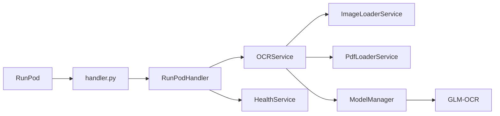

# GLM-OCR RunPod Serverless Worker

Production-ready OCR microservice based on [GLM-OCR](https://huggingface.co/zai-org/GLM-OCR) for [RunPod Serverless](https://www.runpod.io/serverless). The worker loads the model once per process, keeps it in GPU memory, and serves structured JSON OCR results.

## Project overview

This service accepts images (base64 or URL) and optional PDF documents, runs GLM-OCR inference, and returns per-page text with timing metadata. It is designed for:

- **Single model load** per worker process (no reload between requests)
- **Modular architecture** with clear separation of concerns
- **Strict validation** of inputs (format, size, MIME, PDF page limits)
- **Production logging** and structured error responses
- **Docker-first deployment** with model weights baked into the image

## Architecture



| Layer | Responsibility |
|-------|----------------|
| `handler.py` | Thin RunPod entrypoint |
| `app/api/` | Request routing, dependency wiring |
| `app/services/` | Business logic (OCR, loaders, health) |
| `app/models/` | Singleton model loading and inference |
| `app/utils/` | Base64, image/PDF utilities |
| `app/schemas/` | Pydantic request/response models |
| `app/config/` | Environment-based settings |
| `app/core/` | Domain exceptions |

## Folder structure

```
.
├── app/
│   ├── api/              # RunPod handler + worker wiring
│   ├── config/           # Settings
│   ├── core/             # Exceptions
│   ├── models/           # ModelManager (Transformers gateway)
│   ├── schemas/          # Pydantic models
│   ├── services/         # OCR, loaders, health
│   └── utils/            # Base64, image, PDF helpers
├── scripts/
│   └── local_smoke_test.py
├── tests/
├── handler.py            # RunPod entrypoint
├── download_model.py     # Build-time model download
├── start.sh
├── Dockerfile
├── requirements.txt
└── pyproject.toml
```

## Requirements

- Python 3.12
- NVIDIA GPU with CUDA (recommended for production)
- Docker with NVIDIA Container Toolkit (for GPU containers)

## Local development

```bash
python3.12 -m venv .venv
source .venv/bin/activate
pip install torch --index-url https://download.pytorch.org/whl/cu124
pip install -r requirements.txt
pip install -e ".[dev]"

# Run tests
pytest tests/ -v

# Lint / format / typecheck
ruff check app tests
black --check app tests
mypy app
```

For local inference without Docker, set `DEVICE=cpu` if no GPU is available and ensure the model is cached:

```bash
export MODEL_ID=zai-org/GLM-OCR
export HF_HOME=./models/hf
export TRANSFORMERS_CACHE=./models/hf
python download_model.py
python scripts/local_smoke_test.py path/to/image.png
```

## Docker build

```bash
docker build -t glm-ocr-serverless:latest .
```

The image:

- Uses CUDA 12.4 runtime
- Installs Python 3.12 dependencies
- Downloads GLM-OCR into `/models/hf` during build
- Never downloads the model at runtime

### Build with custom model cache path

```bash
docker build \
  --build-arg MODEL_ID=zai-org/GLM-OCR \
  -t glm-ocr-serverless:latest .
```

You can pass env vars at build time:

```bash
docker build \
  --build-arg HF_HOME=/models/hf \
  -t glm-ocr-serverless:latest .
```

## Docker run (local GPU test)

```bash
docker run --rm --gpus all \
  -e LOG_LEVEL=INFO \
  -p 8000:8000 \
  glm-ocr-serverless:latest
```

RunPod manages the serverless runtime; local `docker run` is mainly for image validation.

## RunPod Serverless deployment

### 1. Push image

**GitHub Container Registry (GHCR, automated)**

This repo includes a GitHub Actions workflow that builds and publishes a Docker image to GHCR on each push to `main` and on tags `v*`.

1. In GitHub repo settings, ensure **Actions** are enabled.
2. (Optional) Create a release tag like `v0.1.0` to get a versioned image tag.
3. Find the published image under **Packages** in the GitHub repo/org.

Use this image in RunPod:

`ghcr.io/<owner>/<repo>:main` or `ghcr.io/<owner>/<repo>:sha-<...>` or `ghcr.io/<owner>/<repo>:v0.1.0`

**Docker Hub**

```bash
docker tag glm-ocr-serverless:latest youruser/glm-ocr-serverless:latest
docker push youruser/glm-ocr-serverless:latest
```

**GitHub Container Registry**

```bash
docker tag glm-ocr-serverless:latest ghcr.io/yourorg/glm-ocr-serverless:latest
docker push ghcr.io/yourorg/glm-ocr-serverless:latest
```

### 2. Create Serverless Endpoint

In RunPod Console:

1. Go to **Serverless** → **New Endpoint**
2. Select **Custom Image**
3. Image: `youruser/glm-ocr-serverless:latest` or `ghcr.io/yourorg/glm-ocr-serverless:latest`
4. GPU: see recommendations below
5. Container disk: **≥ 20 GB** (model + dependencies)
6. Expose HTTP port if using RunPod load balancer (default worker uses RunPod job API)

### 3. Endpoint settings

| Setting | Recommendation |
|---------|------------------|
| **GPU** | RTX 4090 / A5000 / L4 (16 GB+ VRAM) |
| **Min workers** | `0` (scale to zero) or `1` (lower cold starts) |
| **Max workers** | Based on expected concurrency (e.g. `3–10`) |
| **Idle timeout** | `5–30` seconds (balance cost vs cold start) |
| **Execution timeout** | `120–300` seconds for large PDFs |

### 4. Environment variables

Set in RunPod endpoint **Environment Variables** (or Secrets for sensitive values):

| Variable | Default | Description |
|----------|---------|-------------|
| `MODEL_ID` | `zai-org/GLM-OCR` | Hugging Face model ID |
| `HF_HOME` | `/models/hf` | Hugging Face cache root |
| `TRANSFORMERS_CACHE` | `/models/hf` | Transformers cache path |
| `DEVICE` | `cuda` | Inference device (`cuda`, `cuda:0`, `cpu`) |
| `TORCH_DTYPE` | `bfloat16` | `float16`, `bfloat16`, `float32` |
| `MAX_IMAGE_SIZE` | `4096` | Max width/height in pixels |
| `LOG_LEVEL` | `INFO` | `DEBUG`, `INFO`, `WARNING`, `ERROR` |
| `ALLOW_URL_IMAGES` | `true` | Enable URL image input |
| `ALLOW_BASE64_IMAGES` | `true` | Enable base64 image input |
| `ALLOW_PDF` | `true` | Enable PDF input |
| `MAX_PAGES` | `50` | Max PDF pages per request |
| `MAX_NEW_TOKENS` | `512` | Max generated tokens per page |
| `REQUEST_TIMEOUT_SECONDS` | `120` | OCR request timeout |

### 5. Handler command

Use the image default:

```
./start.sh
```

Which runs:

```
python -u handler.py
```

## Example requests

### Base64 image

```json
{
  "input": {
    "image": "data:image/png;base64,iVBORw0KGgoAAAANSUhEUg..."
  }
}
```

### Image URL

```json
{
  "input": {
    "image_url": "https://example.com/document.png"
  }
}
```

### PDF (base64)

```json
{
  "input": {
    "pdf": "JVBERi0xLjQKJ..."
  }
}
```

### Custom prompt

```json
{
  "input": {
    "image": "<base64>",
    "prompt": "Text Recognition:"
  }
}
```

### Health check

```json
{
  "input": {
    "health": true
  }
}
```

## Example responses

### Success

```json
{
  "success": true,
  "processing_time_ms": 231,
  "pages": [
    {
      "page": 1,
      "text": "Extracted text content..."
    }
  ]
}
```

### Error

```json
{
  "success": false,
  "error": {
    "code": "INVALID_IMAGE",
    "message": "Corrupted or unreadable image data."
  }
}
```

### Health

```json
{
  "model_loaded": true,
  "gpu_available": true,
  "cuda_version": "12.4",
  "torch_version": "2.4.0",
  "model_id": "zai-org/GLM-OCR",
  "uptime_seconds": 42.5
}
```

## Performance recommendations

- Use **bfloat16** on Ampere+ GPUs (A100, RTX 30xx/40xx, L4)
- Use **float16** on older CUDA GPUs if bfloat16 is unsupported
- Set `MAX_IMAGE_SIZE` to `2048` for faster inference on dense documents
- Keep **min workers ≥ 1** if latency-sensitive (avoids cold starts)
- For PDFs, reduce `MAX_PAGES` to limit per-request GPU time
- Prefer base64/URL images under 5 MB when possible

## GPU recommendations

| Workload | GPU | VRAM |
|----------|-----|------|
| Low volume / dev | RTX 3060 12GB, L4 | 12–16 GB |
| Production | RTX 4090, A5000 | 16–24 GB |
| High throughput | A100 40GB | 40 GB |

GLM-OCR is ~0.9B parameters; 16 GB VRAM is comfortable for single-request inference.

## Troubleshooting

### `CUDA requested but not available`

- Ensure the RunPod endpoint uses a GPU worker
- Verify `DEVICE=cuda` and NVIDIA drivers in the container

### `Failed to load OCR model`

- Confirm the image was built with `download_model.py` (model in `/models/hf`)
- Check container disk size

### `IMAGE_TOO_LARGE`

- Reduce input resolution or increase `MAX_IMAGE_SIZE`
- Images are auto-downscaled when loaded via base64/URL; validation still applies to decoded size

### `TOO_MANY_PAGES`

- Split large PDFs or increase `MAX_PAGES`

### `TIMEOUT`

- Increase `REQUEST_TIMEOUT_SECONDS` on the endpoint
- Reduce PDF pages or image resolution per request

### Cold starts are slow

- Set **min workers** to `1` or higher
- Model loads once per worker on first request / startup

## License

Model weights are subject to the [GLM-OCR model license](https://huggingface.co/zai-org/GLM-OCR). Application code is provided as-is for deployment scaffolding.
